        /* TITULOS */
        h1, h2 { color: #00e5ff; }

        h1 {
            font-size: 60px;
            font-family: 'Segoe UI', sans-serif;
            text-shadow: 0 0 10px rgba(0,229,255,0.5);
        }

        h2 { 
            font-size: 32px;
            text-shadow: 0 0 8px rgba(0,229,255,0.3);
        }

        /* BODY */
        body {
            font-family: 'Arial', sans-serif;
            margin: 0;
            padding: 0;

            background: radial-gradient(circle at top center, 
            rgba(0, 229, 255, 0.12), 
            rgba(0, 0, 0, 0.95) 50%),
            linear-gradient(135deg, #0f2027, #203a43, #000000);

            color: #e6f1ff;
        }

        /* TABS */
        .tabs { 
            margin: 30px 0;
            display: flex;
            justify-content: center;
            align-items: center;
            gap: 15px;; }

        .tabs button {
            padding: 15px 25px;
            margin: 5px;
            border-radius: 12px;
            border: 1px solid rgba(0,229,255,0.2);
            background: linear-gradient(135deg, #0f2027, #203a43);
            color: #00e5ff;
            font-weight: bold;
            cursor: pointer;
            font-size: 16px;
            transition: 0.3s;
            margin: 30px 0;
            display: flex;
            justify-content: center;
            align-items: center;
            gap: 15px;
        }

        .tabs button:hover {
            background: linear-gradient(135deg, #203a43, #2c5364);
            box-shadow: 0 0 10px rgba(0,229,255,0.4);
        }

        /* CONTENEDOR PRODUCTOS */
        #productosFiguras, 
        #productosLlaveros, 
        #productosJuguetes {
            display: flex;
            flex-wrap: wrap;
            justify-content: center;
            gap: 20px;
            margin-bottom: 50px;
        }

        /* TARJETAS */
        .producto {
            background: linear-gradient(145deg, #2c3e50, #3b536b);
            margin: 25px auto;
            padding: 20px;
            border-radius: 18px;
            color: #e6f1ff;
            width: 280px;

            box-shadow: 
            0 10px 25px rgba(0,0,0,0.6),
            inset 0 1px 0 rgba(255,255,255,0.05);

            border: 1px solid rgba(255,255,255,0.08);
            backdrop-filter: blur(8px);

            transition: all 0.3s ease;
        }

        .producto:hover {
            transform: translateY(-10px) scale(1.03);
            box-shadow: 
            0 20px 40px rgba(0,0,0,0.8),
            0 0 20px rgba(0, 229, 255, 0.25);
        }

        /* DESCRIPCION */
        .descripcion {
            color: #cce7ff;
            font-family: 'Segoe UI', sans-serif;
        }

        /* PRECIO */
        .precio {
            color: #00ff9f;
            font-size: 20px;
            font-weight: bold;
        }

        /* BOTONES GENERALES */
        button {
            background: linear-gradient(135deg, #00e5ff, #00bcd4);
            color: #002b36;
            padding: 8px 16px;
            border: none;
            border-radius: 20px;
            margin: 5px;
            font-weight: bold;
            cursor: pointer;
            transition: 0.3s;
        }

        button:hover {
            transform: scale(1.1);
            box-shadow: 0 0 10px rgba(0,229,255,0.6);
        }

        /* IMAGENES */
        .producto img {
            display: block;
            margin: auto;
            border-radius: 12px;
        }

        /* INFO ENVIO */
        .info-envio {
            color: #cce7ff;
            font-size: 18px;
            margin: 15px 0;
            font-weight: bold;
            text-align: center;
        }

        /* CARRITO */
        #sidebarCarrito {
            position: fixed;
            top: 0;
            right: -360px;
            width: 360px;
            height: 100%;
            background: #1c2a38;
            color: white;
            padding: 20px;
            transition: right 0.3s ease;
            z-index: 1000;
            overflow-y: auto;
        }

        #abrirCarrito {
            position: fixed;
            top: 20px;
            right: 20px;
            padding: 12px 16px;
            border-radius: 12px;
            border: none;
            background: linear-gradient(135deg, #0f2027, #203a43);
            color: #00e5ff;
            font-weight: bold;
            cursor: pointer;
            z-index: 1100;
        }

        /* INPUTS */
        input, select {
            padding: 10px;
            margin: 5px;
            border-radius: 10px;
            border: none;
            width: 90%;
        }

        .carrito-item {
            margin-bottom: 15px;
            border-bottom: 1px solid #ccc;
            padding-bottom: 10px;
        }

        #cerrarCarrito {
            background-color: #ff6b6b;
            color: white;
            margin-top: 20px;
        }

        /* LOADING */
        .loading {
            display: none;
            position: fixed;
            top: 50%;
            left: 50%;
            transform: translate(-50%, -50%);
            background: rgba(0,0,0,0.8);
            color: white;
            padding: 20px;
            border-radius: 10px;
            z-index: 2000;
        }

        /* LOGO */
        .logo-titulo {
            display: flex;
            align-items: center;
            justify-content: center; 
            gap: 15px;
            color: #00e5ff; 
            font-size: 70px;
            font-family: 'Segoe UI', sans-serif;
            text-shadow: 0 0 12px rgba(0,229,255,0.5);
            text-align: center;
        }

        .logo-img {
            width: 110px;  
            height: 110px;
            object-fit: contain;
        }

</style>
</head>

<body>

<h1 class="logo-titulo">
    
    JS 3D
</h1>

💰 Pago por Nequi 
Diseños personalizados al WhatsApp 
3007024381 

    <button onclick="mostrarTab('figuras')">Figuras</button>
    <button onclick="mostrarTab('llaveros')">Llaveros</button>
    <button onclick="mostrarTab('juguetes')">Juguetes</button>

<button id="abrirCarrito">🛒 Carrito</button>

<!-- FIGURAS -->

    

        

            <h2>Ghost Face</h2>
            
$15.000

            
Altura: 10cm

            
            <button onclick="comprar('Ghost Face',15000)">Comprar</button>
        

        

            <h2>Michael Jackson Thriller</h2>
            
$20.000

            
Altura: 10cm

            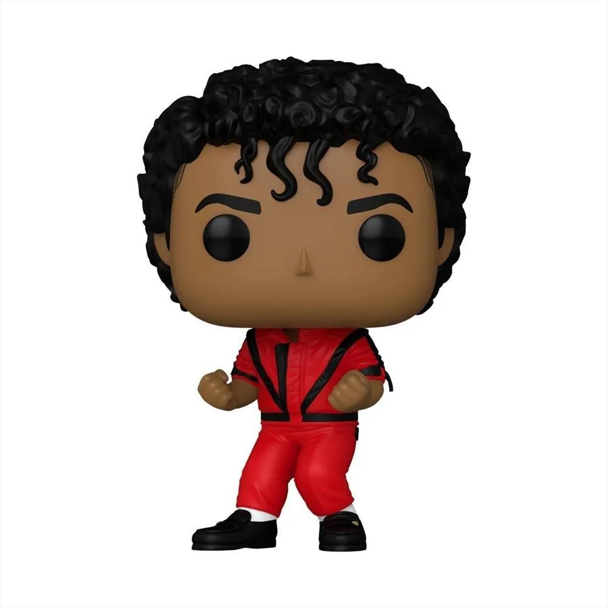
            <button onclick="comprar('Michael Jackson Thriller',20000)">Comprar</button>
        

        

            <h2>Michael Jackson Earth Song</h2>
            
$20.000

            
Altura: 10cm

            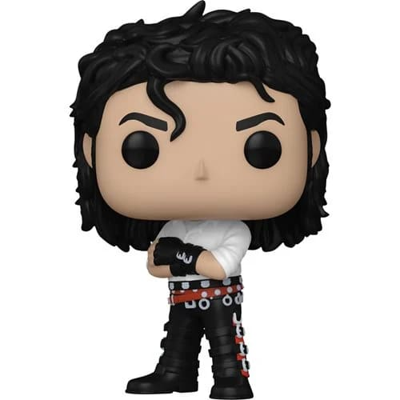
            <button onclick="comprar('Michael Jackson Earth Song',20000)">Comprar</button>
        

        
        
        

            <h2>Skeleton</h2>
            
$13.000

            
Altura: 10cm

            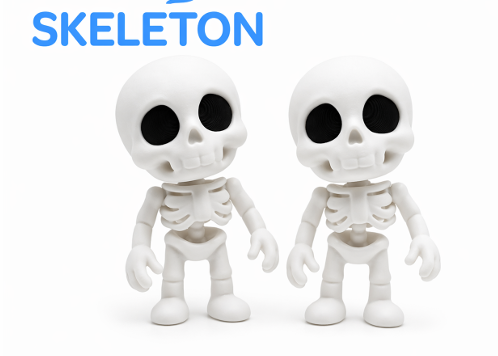
            <button onclick="comprar('Skeleton',13000)">Comprar</button>
        

        

            <h2>Planterman</h2>
            
$18.000

            
Altura: 11cm

            
            <button onclick="comprar('Planterman',18000)">Comprar</button>
        

        

            <h2>Araña Articulada</h2>
            
$15.000

            
Altura: 11cm

            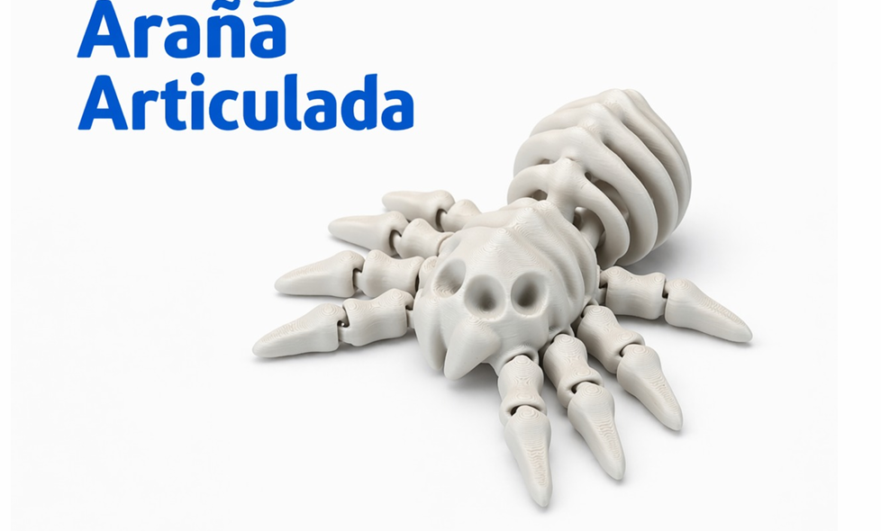
            <button onclick="comprar('Araña Articulada',15000)">Comprar</button>
        

        

            <h2>Soporte para audifonos</h2>
            
$15.000

            
Altura: 11cm

            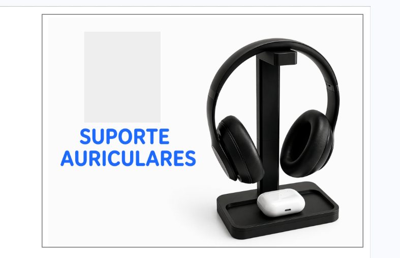
            <button onclick="comprar('Soporte para audifonos',15000)">Comprar</button>
        

    

<!-- LLAVEROS -->

    

        

            <h2>Mini Dragon</h2>
            
$5.000

            
Altura: 4cm

            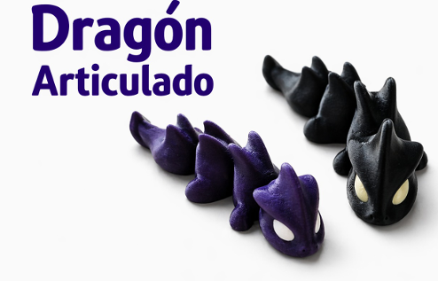
            <button onclick="comprar('Mini Dragon',5000)">Comprar</button>
        

        

            <h2>Baby Shark</h2>
            
$8.000

            
Altura: 3cm

            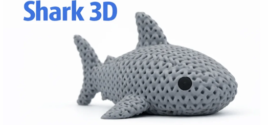
            <button onclick="comprar('Baby Shark',8000)">Comprar</button>
        

        

            <h2>Tortuga</h2>
            
$8.000

            
Altura: 3cm

            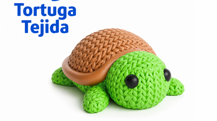
            <button onclick="comprar('Tortuga',8000)">Comprar</button>
        

        

            <h2>Calavera callejera</h2>
            
$8.000

            
Altura: 3cm

            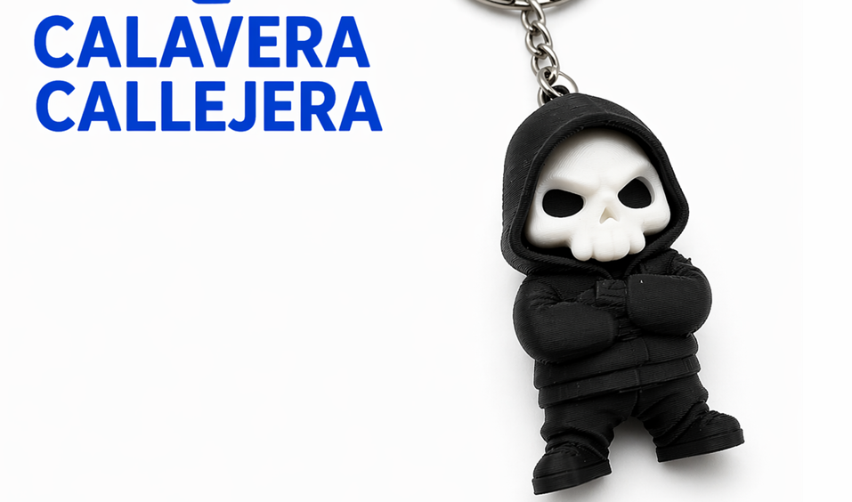
            <button onclick="comprar('Calavera callejera',8000)">Comprar</button>
        

        

            <h2>Falxias de Graduacao</h2>
            
$8.000

            
Altura: 3cm

            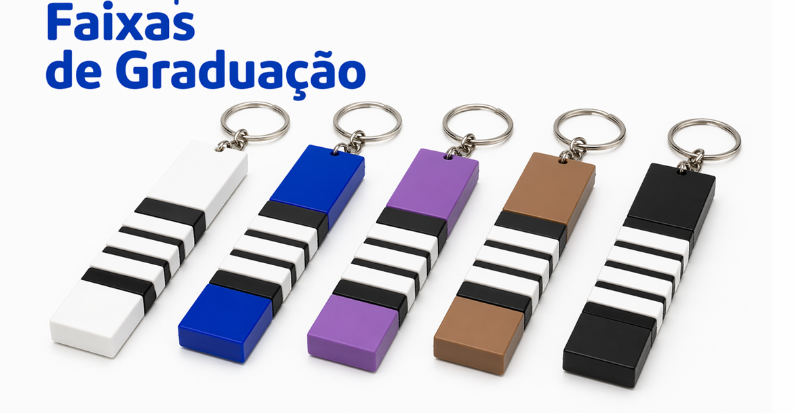
            <button onclick="comprar('Falxias de Graduacao ',8000)">Comprar</button>
        

        

            <h2>Fantasmin</h2>
            
$5.000

            
Altura: 3cm

            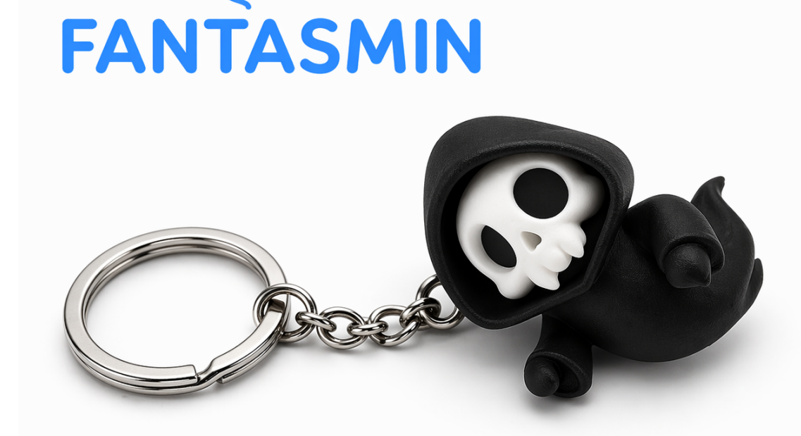
            <button onclick="comprar('Fantasmin ',5000)">Comprar</button>
        

        

            <h2>Panda Callejero</h2>
            
$8.000

            
Altura: 3cm

            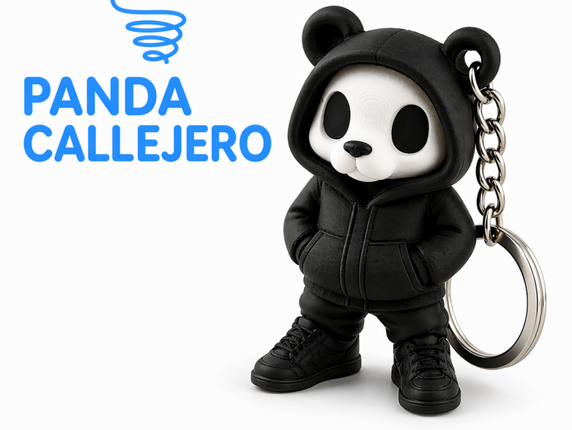
            <button onclick="comprar('Panda Callejero',8000)">Comprar</button>
        

        

            <h2>Cat</h2>
            
$7.000

            
Altura: 3cm

            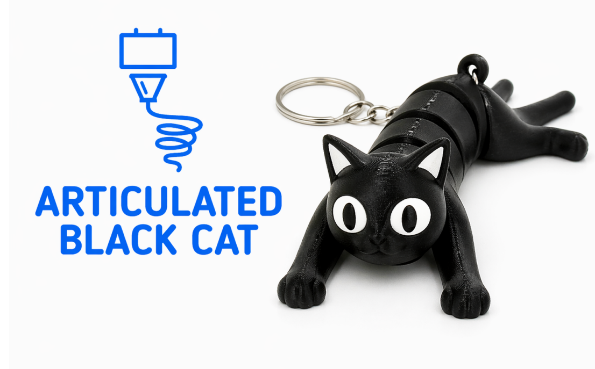
            <button onclick="comprar('Cat',7000)">Comprar</button>
        

        

            <h2>Pandita</h2>
            
$7.000

            
Altura: 3cm

            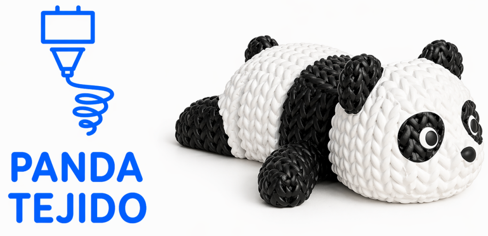
            <button onclick="comprar('Pandita',7000)">Comprar</button>
        

    

<!-- JUGUETES -->

    

        

            <h2>Flexi Rex</h2>
            
$10.000

            
Altura: 8cm

            
            <button onclick="comprar('Flexi Rex',10000)">Comprar</button>
        

        

            <h2>Dragon Crystal XL</h2>
            
$35.000

            
Altura: 8cm

            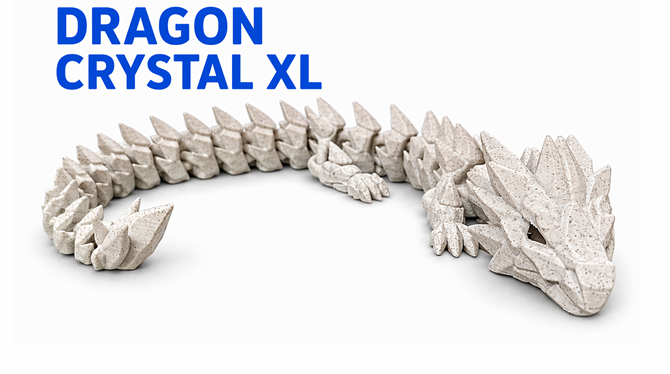
            <button onclick="comprar('Dragon Crystal XL',35000)">Comprar</button>
        

        

            <h2>Dragon Cristal S</h2>
            
$14.000

            
Altura: 8cm

            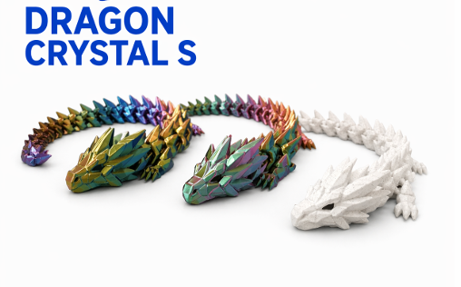
            <button onclick="comprar('Dragon Crystal S',14000)">Comprar</button>
        

        

            <h2>Dragon Gusano</h2>
            
$14.000

            
Altura: 8cm

            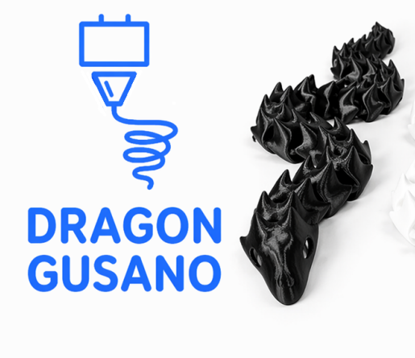
            <button onclick="comprar('Dragon Gusano',14000)">Comprar</button>
        

    

<!-- CARRITO -->

    <h2>🛍️ Carrito</h2>
    

No hay productos en el carrito

    <h3>Total: $0</h3>

    <h3>📋 Datos de envío</h3>
    <input type="text" id="nombre" placeholder="Nombre completo" required>
    <input type="tel" id="numero" placeholder="Número de contacto" required>
    <input type="text" id="direccion" placeholder="Dirección" required>

    <select id="medioPago" required>
        <option value="">Selecciona medio de pago</option>
        <option value="Efectivo">Efectivo</option>
        <option value="Nequi">Nequi</option>
    </select>

    <button onclick="enviarPedido()" style="background-color: #25D366; color: white; margin-top: 20px;">💬 Enviar pedido</button>
    <button id="cerrarCarrito">❌ Cerrar</button>

    ⏳ Enviando pedido...

</body>
</html>
